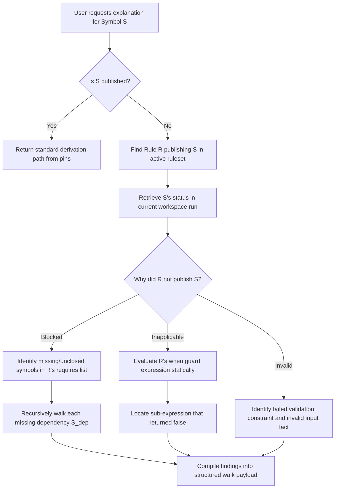
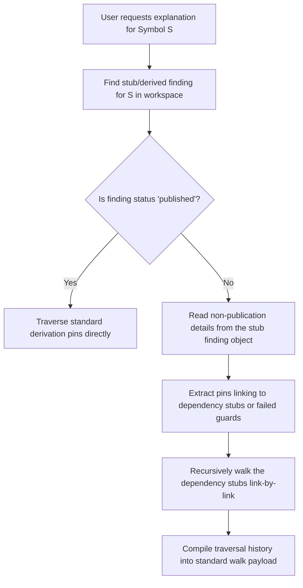

# Design Proposal: Non-Publication Explanations in the Derivation Cascade

This document presents the iteration 1 design for representing and traversing the lineage of non-published form-fields—specifically fields whose derivation disposition is `blocked`, `guard_inapplicable`, or `invalid` (per ADR-0012). It compares two architectural shapes:

* **Shape A (Rule AST/Schema Dependency Walk):** The explanation walker inspects the unexecuted rule's dependencies and applicability guards statically from schemas and rule definitions to reconstruct the blocked path.
* **Shape B (Dry-Run / Stub Finding Acts):** The runner records lightweight "dry-run" stub finding acts in the log when a rule fails to execute, and the explanation walker traverses these stubs.

---

## Shape A: Rule AST/Schema Dependency Walk

Under Shape A, the workspace act log and derived findings store remains strictly limited to valid, successfully computed facts. No stub records are written. When a user requests an explanation for a non-published symbol, the explanation walker dynamically reconstructs the lineage by querying the active rule definitions (ASTs) and evaluating why they failed.

### 1. Walk Algorithm (Shape A)



#### Steps:
1. **Target Identification:** Retrieve the target symbol $S$.
2. **Rule Resolution:** Look up the active rule citizen(s) $R$ that publish $S$.
3. **Dependency Check:** For each rule $R$:
   * Verify the status of each symbol in $R$'s `requires` array against the derivation record.
   * If any required symbol is **missing** (unasserted) or **blocked** (unresolved), mark this rule's block reason as `missing_dependency` and recursively invoke the walk algorithm on the missing dependency symbol.
   * If any required symbol is present but flagged as **invalid** (due to a failed fact validation constraint), mark this rule's block reason as `invalid_dependency` and link to the failed constraint.
4. **Guard Evaluation (Inapplicability):** If all dependencies in `requires` are present and valid, but the rule was not executed, evaluate the rule's `when` guard expression against the asserted values. Trace the boolean evaluation tree to isolate the exact leaf condition that returned `false`.
5. **Compilation:** Construct and return the structured lineage tree.

---

### 2. Explanation Walk Payload Schema

##### [NEW] `explanation-walk.v1.schema.json`
```json
{
  "$schema": "https://json-schema.org/draft/2020-12/schema",
  "$id": "derivation/explanation-walk.v1",
  "title": "Explanation Walk",
  "description": "Structured lineage explaining why a symbol was or was not published.",
  "type": "object",
  "properties": {
    "schema": { "const": "explanation-walk.v1" },
    "symbol": { "type": "string", "minLength": 1 },
    "disposition": { "enum": ["published_value", "computed_zero", "closure_backed_zero", "blocked", "guard_inapplicable", "invalid"] },
    "value": {},
    "rules": {
      "type": "array",
      "items": {
        "type": "object",
        "required": ["rule_id", "rule_role", "disposition"],
        "additionalProperties": false,
        "properties": {
          "rule_id": { "type": "string", "minLength": 1 },
          "rule_role": { "enum": ["computation", "applicability", "field-mapping", "cross-form-bridge"] },
          "disposition": { "enum": ["published", "blocked", "inapplicable"] },
          "failures": {
            "type": "array",
            "items": {
              "type": "object",
              "required": ["type"],
              "additionalProperties": false,
              "properties": {
                "type": { "enum": ["missing_dependency", "invalid_dependency", "unclosed_collection", "failed_guard"] },
                "symbol": { "type": "string" },
                "expression_trace": { "type": "string", "description": "Human-readable trace of the failed expression." },
                "failed_constraint": { "type": "string", "description": "Validation constraint description that failed." }
              }
            }
          },
          "dependencies": {
            "type": "array",
            "items": { "$ref": "#" }
          }
        }
      }
    }
  },
  "required": ["schema", "symbol", "disposition", "rules"],
  "additionalProperties": false
}
```

---

### 3. Instance Payloads (Shape A)

#### Case 1: Unclosed interest collection blocking Line 2b and downstream
* **Scenario:** Wage citizen is present but 1099-INT family is unclosed, causing `demo.form1040.line2b` to block, which in turn blocks `demo.form1040.line9` (total income).
* **Payload Instance:**
```json
{
  "schema": "explanation-walk.v1",
  "symbol": "demo.form1040.line9",
  "disposition": "blocked",
  "rules": [
    {
      "rule_id": "demo.rule.total-income-line9",
      "rule_role": "computation",
      "disposition": "blocked",
      "failures": [
        { "type": "missing_dependency", "symbol": "demo.form1040.line2b" }
      ],
      "dependencies": [
        {
          "schema": "explanation-walk.v1",
          "symbol": "demo.form1040.line2b",
          "disposition": "blocked",
          "rules": [
            {
              "rule_id": "demo.rule.taxable-interest-line2b",
              "rule_role": "field-mapping",
              "disposition": "blocked",
              "failures": [
                { "type": "unclosed_collection", "symbol": "demo.1099int" }
              ],
              "dependencies": []
            }
          ]
        }
      ]
    }
  ]
}
```

#### Case 2: Inapplicable Itemization Override
* **Scenario:** Married Filing Jointly return, but itemization override is inapplicable because standard deduction ($30,000) is larger than itemized deductions ($12,000).
* **Payload Instance:**
```json
{
  "schema": "explanation-walk.v1",
  "symbol": "demo.form1040.line12",
  "disposition": "published_value",
  "value": 30000,
  "rules": [
    {
      "rule_id": "demo.rule.standard-deduction-selector",
      "rule_role": "computation",
      "disposition": "published",
      "dependencies": []
    },
    {
      "rule_id": "demo.rule.itemized-deduction-override",
      "rule_role": "computation",
      "disposition": "inapplicable",
      "failures": [
        {
          "type": "failed_guard",
          "expression_trace": "itemized_deductions (12000) > standard_deduction (30000) => false"
        }
      ],
      "dependencies": []
    }
  ]
}
```

---

## Shape B: Dry-Run / Stub Finding Acts

Under Shape B, the derivation runner writes lightweight stub derived findings to the workspace/log when a rule is blocked or inapplicable. These stubs are recorded in the active derived finding set but carry a metadata field marking them as non-published, citing the block/inapplicability reasons. The explanation walker simply traverses these stub findings.

### 1. Walk Algorithm (Shape B)



#### Steps:
1. **Target Lookup:** Query the workspace for the derived finding associated with symbol $S$. Unlike Shape A, a stub finding object *always* exists in the active run context if the rule was registered.
2. **Direct Pin Follow:**
   * If the stub finding status is `"blocked"`, read the `missing_pins` array inside the stub finding and follow each pin recursively to its producer stub finding.
   * If the stub finding status is `"guard_inapplicable"`, read the `guard_failure` payload recorded on the stub finding.
3. **No AST Evaluation:** The walker does not parse guards or verify requires arrays dynamically; it reads the static reasons recorded by the runner at execution time.

---

### 2. Stub Finding Schema

Shape B requires extending `derived-finding.v1` to allow a non-published status, recording missing pins, failed guards, and invalid facts directly on the finding object.

##### [NEW] `stub-finding.v1.schema.json`
```json
{
  "$schema": "https://json-schema.org/draft/2020-12/schema",
  "$id": "derivation/stub-finding.v1",
  "title": "Stub Finding",
  "description": "A lightweight stub record written to the workspace to document a blocked or inapplicable calculation.",
  "type": "object",
  "properties": {
    "schema": { "const": "stub-finding.v1" },
    "id": { "type": "string", "minLength": 1 },
    "symbol": { "type": "string", "minLength": 1 },
    "version": { "const": "v1" },
    "disposition": { "enum": ["blocked", "guard_inapplicable", "invalid"] },
    "rule_id": { "type": "string", "minLength": 1 },
    "missing_symbols": { "type": "array", "items": { "type": "string" } },
    "failed_guard_trace": { "type": "string" },
    "failed_constraint": { "type": "string" },
    "pins": {
      "type": "array",
      "items": {
        "type": "object",
        "properties": {
          "role": { "type": "string" },
          "id": { "type": "string" },
          "version": { "type": "string" }
        },
        "required": ["role", "id", "version"]
      }
    }
  },
  "required": ["schema", "id", "symbol", "version", "disposition", "rule_id"],
  "additionalProperties": false
}
```

---

### 3. Instance Payloads (Shape B)

#### Case 1: Stub Findings for Unclosed Interest Collection

##### `demo.finding.line9.stub.json`
```json
{
  "schema": "stub-finding.v1",
  "id": "demo.finding.line9.stub",
  "symbol": "demo.form1040.line9",
  "version": "v1",
  "disposition": "blocked",
  "rule_id": "demo.rule.total-income-line9",
  "missing_symbols": ["demo.form1040.line2b"],
  "pins": [
    { "role": "blocked_dependency", "id": "demo.finding.line2b.stub", "version": "v1" }
  ]
}
```

##### `demo.finding.line2b.stub.json`
```json
{
  "schema": "stub-finding.v1",
  "id": "demo.finding.line2b.stub",
  "symbol": "demo.form1040.line2b",
  "version": "v1",
  "disposition": "blocked",
  "rule_id": "demo.rule.taxable-interest-line2b",
  "missing_symbols": ["demo.1099int"],
  "pins": []
}
```

#### Case 2: Stub Finding for Inapplicable Itemization Override

##### `demo.finding.itemization-override.stub.json`
```json
{
  "schema": "stub-finding.v1",
  "id": "demo.finding.itemization-override.stub",
  "symbol": "demo.form1040.itemization_override",
  "version": "v1",
  "disposition": "guard_inapplicable",
  "rule_id": "demo.rule.itemized-deduction-override",
  "failed_guard_trace": "itemized_deductions (12000) > standard_deduction (30000) => false",
  "pins": []
}
```

---

## Comparative Analysis

| Dimension | Shape A (AST/Schema Walk) | Shape B (Stub Findings) |
| :--- | :--- | :--- |
| **Workspace Log Purity** | **High.** Leaves the log clean of non-publication facts. Only true results persist (Article 12/13). | **Low.** Floods the log/workspace with stub records for every unexecuted rule pathway. |
| **Logic/Parameter Separation** | **Clean.** Walker reads static rule parameters and ASTs on-demand. | **Coupled.** Runner must serialize execution failure metadata into data payloads. |
| **Graph Traversal Simplicity** | **Complex.** Walker must implement expression evaluation and AST parsing. | **Simple.** Walker is a pure graph pointer traverser following static pins. |
| **Runtime Performance** | **Zero Overhead.** Rule failures incur no serialization or storage costs during execution. | **High Overhead.** Runner must generate and store stubs for hundreds of unexecuted rules. |
| **Out-of-Sync Risk** | **Medium.** Potential for walk evaluator to diverge from runner evaluator. | **Zero.** The runner records the actual reasons it failed during execution. |
| **Incrementality & Displacement** | **Clean.** Displacement is simple; unexecuted rules do not exist in the active graph. | **Fragile.** Stubs must be tracked and garbage-collected when inputs change. |
